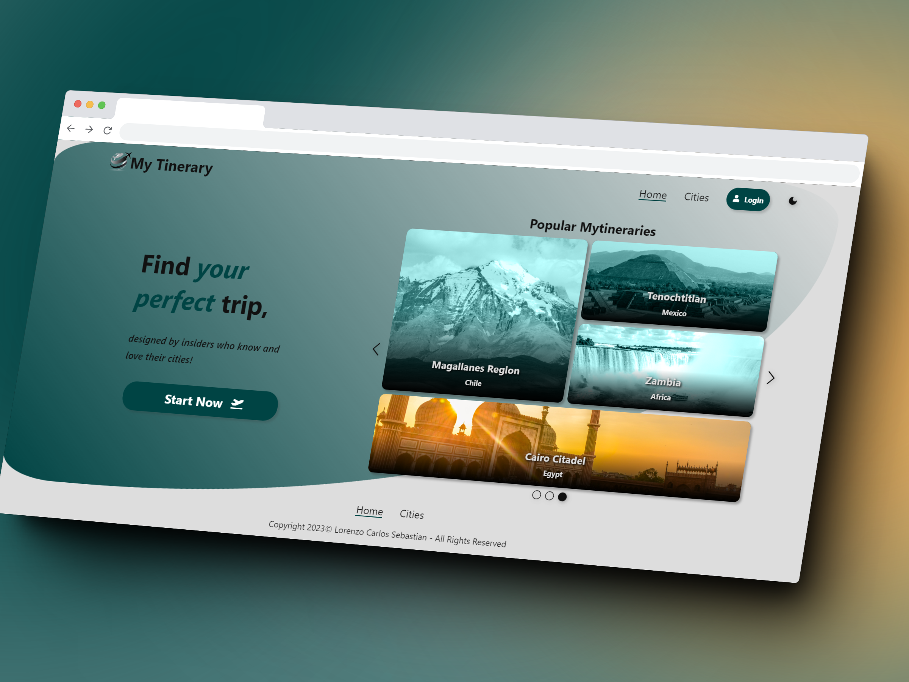
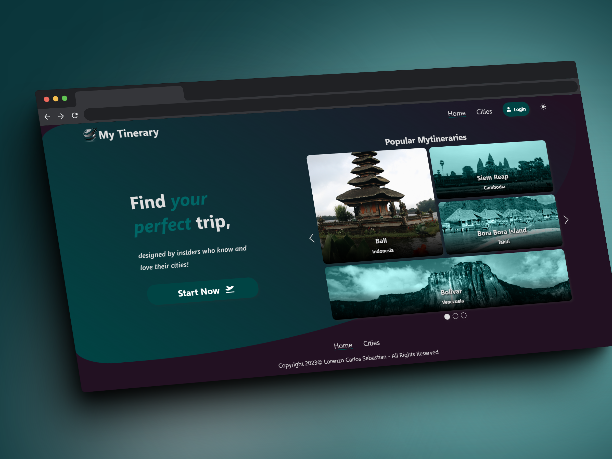
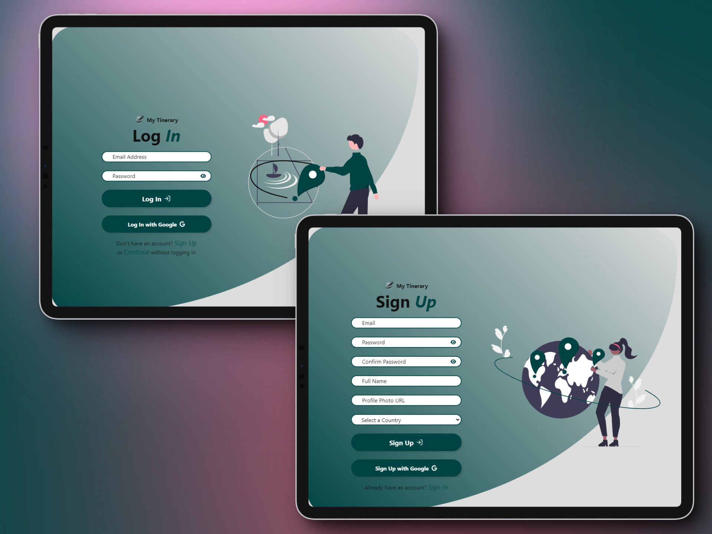
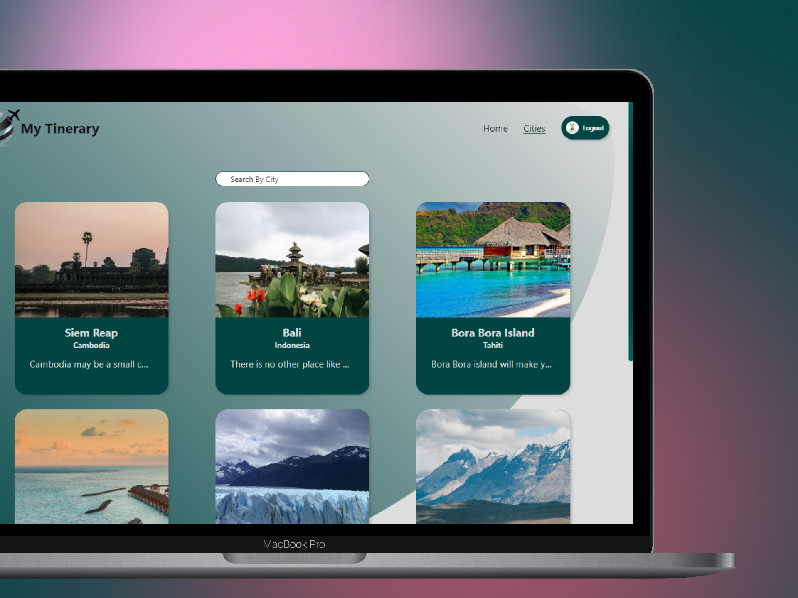
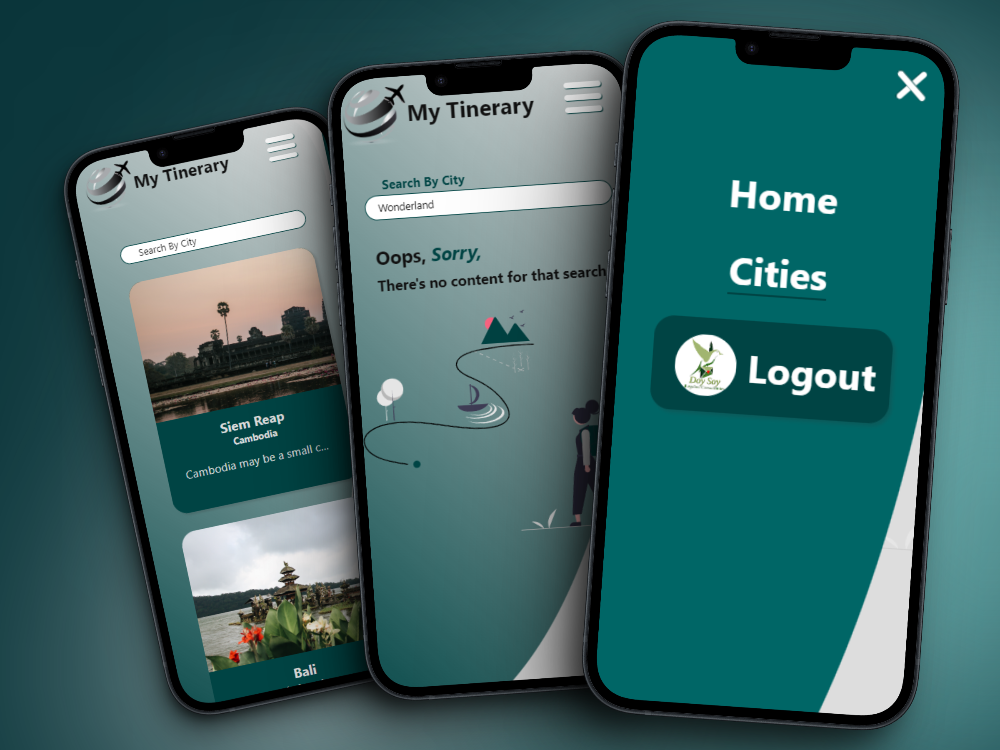
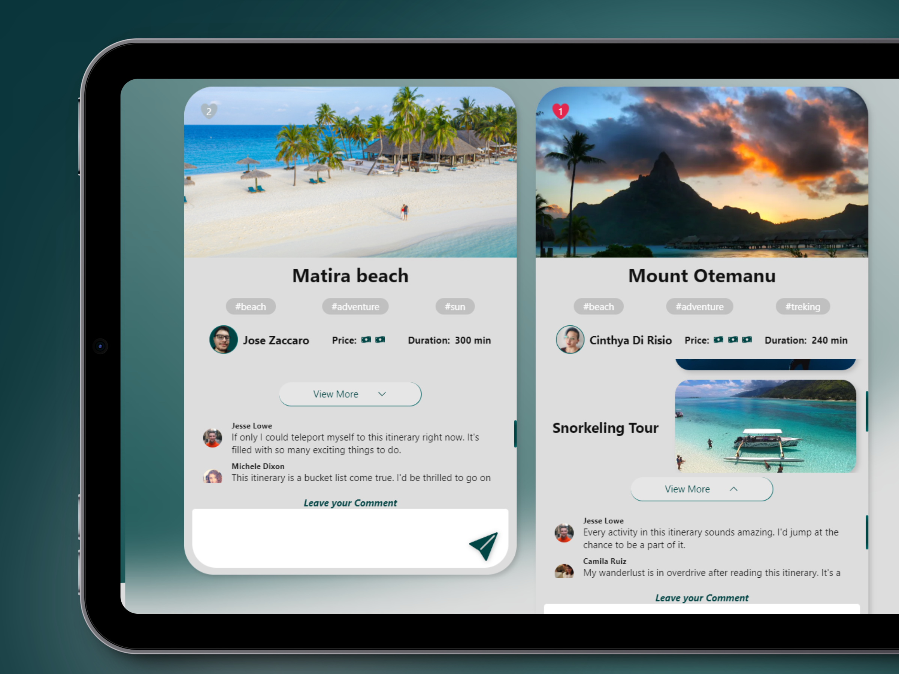

# MyTinerary

This website was created at the Full Stack MERN bootcamp of MindHub LA like a task.
Given by the mentors:

**[Cinthya Di Risio](https://github.com/cinthyadirisio)**

**[Jose Antonio Lopez Zaccaro](https://github.com/JoseZaccaro)**

**[Franco Sosa Gauna](https://www.linkedin.com/in/franco-sosagauna/)**

**[Nicolas Cirulli](https://github.com/NicolasCirulli)**

Click on this link to visit the website: **[my-tinerary-black.vercel.app/](my-tinerary-black.vercel.app/)**

